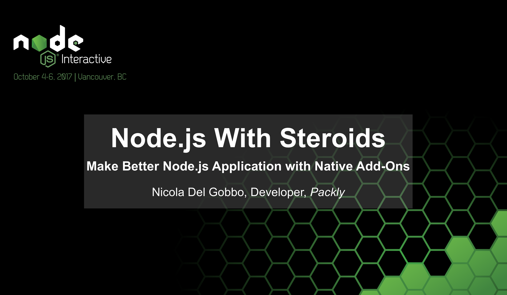

# Node.js With Steroids

## Make Better Node.js Application with Native Add-Ons

### Binding.gyp resources

* **[Documentation](https://gyp.gsrc.io/docs/UserDocumentation.md)** 

* **[Examples from node-gyp wiki](https://github.com/nodejs/node-gyp/wiki/"binding.gyp"-files-out-in-the-wild)**

### Protobuf to transfer data between JS an C / C++ context

#### [Protobuf for Node.js](https://code.google.com/archive/p/protobuf-for-node/) 

### Node.js C / C ++ Addons

#### [Documenttation of Node.js Native Addons](https://nodejs.org/dist/latest-v8.x/docs/api/addons.html)

### N-API 

#### [Documentation for N-API](https://nodejs.org/dist/latest-v8.x/docs/api/n-api.html)

### Native Abstractions for Node.js 

#### [Documentation for NAN](https://github.com/nodejs/nan)

### Web resources
* **[V8 Dcoumentation for Node.js](https://v8docs.nodesource.com/)**
* **[V8 Data Types](https://annamag.github.io/codeandart/outreachy/V8-Data-Types/)**
* **[V8 blog](https://v8project.blogspot.it/)**
* **[Understanding V8 bytecode](https://medium.com/dailyjs/understanding-v8s-bytecode-317d46c94775)**
* **[How to get a performance boost using Node.js native addons](https://medium.com/developers-writing/how-to-get-a-performance-boost-using-node-js-native-addons-fd3a24719c85)**
* **[N-API Next generation Node API for native modules](https://www.slideshare.net/michaeldawson3572846/n-apinode-summit2017final)**
* **[Start with N-API](https://hackernoon.com/n-api-and-getting-started-with-writing-c-addons-for-node-js-cf061b3eae75)**
* **[Nodeaddons.com](https://nodeaddons.com/)**

### Nicola Del Gobbo

<https://github.com/NickNaso/>

<https://www.npmjs.com/~nicknaso>

<https://twitter.com/NickNaso>

## Acknowledgements

Thank you to all people that encourage me every day.

## License

Licensed under [Apache license V2](./LICENSE)

